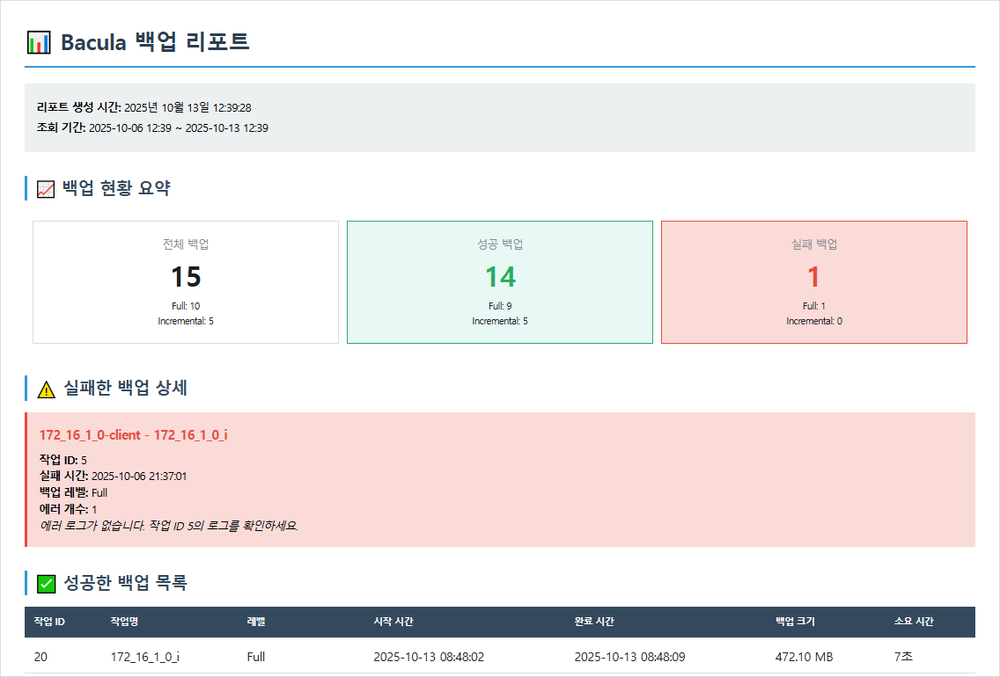

# Bacula Backup Report System

Bacula API를 통해 백업 작업 정보를 조회하고 HTML 리포트를 자동 생성하는 시스템입니다.

## 📋 기능

- Bacula REST API를 통한 백업 작업 조회
- 성공/실패/진행 중/취소됨 작업 분류
- HTML 형식의 백업 리포트 자동 생성
- **Gmail SMTP를 통한 백업 리포트 자동 메일 발송**
- 테스트 모드 및 프로덕션 모드 지원
- 상세한 로깅 및 에러 처리

## 🛠 기술 스택

- **언어**: Python 3.12
- **주요 라이브러리**:
  - `requests`: API 호출
  - `jinja2`: HTML 템플릿 렌더링
  - `python-dotenv`: 환경 변수 관리
  - `premailer`: 이메일 HTML CSS 인라인 변환
  - `pytest`: 테스트

## 📦 설치 방법

### 1. 가상환경 생성 및 활성화

```bash
python -m venv .venv
source .venv/bin/activate  # Linux/Mac
```

### 2. 필수 패키지 설치

```bash
pip install --upgrade pip
pip install -r requirements.txt
```

### 3. 환경 설정

`.env.example` 파일을 복사하여 `.env` 파일을 생성하고 실제 값을 입력합니다:

```bash
cp .env.example .env
```

`.env` 파일 내용:

```ini
# Bacula API 설정
BACULUM_API_HOST=baculum_ip_address
BACULUM_API_PORT=9096
BACULUM_API_USERNAME=your_username
BACULUM_API_PASSWORD=your_password

# Baculum Web Interface (선택사항)
BACULUM_WEB_HOST=baculum_web_host_address
BACULUM_WEB_PORT=9095

# 메일 발송 설정 (선택사항)
SMTP_SERVER=smtp.gmail.com
SMTP_PORT=587
SMTP_USERNAME=your_gmail_address@gmail.com
SMTP_PASSWORD=your_16_digit_app_password
MAIL_FROM=your_gmail_address@gmail.com
MAIL_TO=recipient@example.com
```

## 🚀 사용 방법

### 기본 실행

```bash
# 테스트 모드 (최근 1주일 데이터)
python -m src.main --mode test

# 프로덕션 모드 (전일 22시 ~ 현재)
python -m src.main --mode production

# 메일 발송 포함
python -m src.main --mode production --send-mail
```

### 상세 로그 출력

```bash
python -m src.main --mode test --verbose

# 메일 발송 포함 + 상세 로그
python -m src.main --mode test --send-mail --verbose
```

### 출력 파일명 지정

```bash
python -m src.main --mode test --output custom_report.html
```

## 📂 프로젝트 구조

```
baculum/
├── src/
│   ├── api/                 # API 클라이언트
│   │   └── bacula_client.py
│   ├── mail/                # 메일 발송 모듈
│   │   ├── __init__.py
│   │   └── email_sender.py
│   ├── models/              # 데이터 모델
│   │   ├── backup_job.py
│   │   └── report_stats.py
│   ├── report/              # 리포트 생성
│   │   └── report_generator.py
│   ├── utils/               # 유틸리티
│   │   ├── config.py
│   │   ├── logger.py
│   │   └── datetime_helper.py
│   └── main.py              # 메인 프로그램
├── templates/               # HTML 템플릿
│   └── report_template.html
├── reports/                 # 생성된 리포트
├── logs/                    # 로그 파일
├── tests/                   # 테스트 코드
├── .env                     # 환경 변수 (git 제외)
├── .env.example             # 환경 변수 예시
├── requirements.txt         # 의존성 패키지
└── README.md
```

## 🧪 테스트

```bash
# 전체 테스트 실행
pytest -v

# 커버리지 포함
pytest -v --cov=src

# 특정 테스트 파일만 실행
pytest tests/test_models.py -v
```

## 📊 리포트 예시

생성된 HTML 리포트에는 다음 정보가 포함됩니다:

- **백업 현황 요약**: 전체/성공/실패/실행 중 백업 수 (Full/Incremental 레벨별 세부 정보)
- **실패한 백업 상세**: 실패한 작업의 상세 정보 및 에러 로그
- **성공한 백업 목록**: 완료 시간, 백업 크기, 소요 시간 등
- **진행 중인 백업**: 현재 실행 중인 작업 목록
- **취소된 백업**: 취소된 작업 목록

### 리포트 화면



## ⚙️ 설정

### API 설정

`.env` 파일에서 다음 설정을 변경할 수 있습니다:

```ini
# API 연결 정보
BACULUM_API_HOST=172.16.1.0
BACULUM_API_PORT=9096
BACULUM_API_USERNAME=admin
BACULUM_API_PASSWORD=password
```

### 메일 발송 설정 (선택사항)

Gmail SMTP를 통해 백업 리포트를 자동으로 메일 발송할 수 있습니다:

```ini
# Gmail SMTP 설정
SMTP_SERVER=smtp.gmail.com
SMTP_PORT=587
SMTP_USERNAME=your_gmail_address@gmail.com
SMTP_PASSWORD=your_16_digit_app_password  # Gmail 앱 비밀번호
MAIL_FROM=your_gmail_address@gmail.com
MAIL_TO=recipient@example.com
```

**Gmail 앱 비밀번호 생성 방법:**
1. Gmail 계정에서 2단계 인증 활성화
2. Google 계정 > 보안 > 2단계 인증 > 앱 비밀번호
3. 생성된 16자리 비밀번호를 `.env` 파일에 입력

**주의사항:**
- 메일 설정은 선택사항입니다 (설정하지 않아도 리포트 생성 가능)
- `.env` 파일은 git에 커밋하지 마세요
- 앱 비밀번호는 안전하게 보관하세요

### Baculum 웹 인터페이스 연동 (선택사항)

리포트에서 각 백업 작업의 상세 정보를 Baculum 웹 인터페이스에서 확인할 수 있도록 링크를 추가할 수 있습니다:

```ini
# Baculum Web Interface
BACULUM_WEB_HOST=172.16.1.0
BACULUM_WEB_PORT=9095
```

**설정 방법:**
- Baculum API와 Web 인터페이스는 다른 포트를 사용합니다 (API: 9096, Web: 9095)
- 호스트 주소는 동일하게 설정하되 포트만 변경하면 됩니다
- 설정 시 성공한 백업 목록에 🔍 돋보기 아이콘이 표시되며, 클릭하면 Baculum 웹에서 상세 정보를 확인할 수 있습니다

**주의사항:**
- Baculum 웹 설정은 선택사항입니다 (설정하지 않아도 리포트 생성 가능)
- 설정하지 않으면 상세보기 컬럼에 "-"가 표시됩니다

### 조회 기간

- **테스트 모드**: 현재 시점에서 1주일 전까지의 데이터 조회
- **프로덕션 모드**: 전일 22시부터 현재 시점까지의 데이터 조회

## 🔧 코드 품질

```bash
# flake8 코드 스타일 검사
flake8 src/
```

## 📝 로그

로그 파일은 `logs/` 디렉토리에 저장됩니다:

- 파일명: `app_YYYYMMDD.log`
- 로테이션: 10MB 단위, 최대 5개 파일 유지
- 레벨: DEBUG (파일), INFO (콘솔)

## 🐛 트러블슈팅

### API 연결 실패

```
✗ API 오류: API 연결 실패
```

**해결 방법**:
1. `.env` 파일의 API 주소와 포트 확인
2. Bacula 서버가 실행 중인지 확인
3. 네트워크 연결 확인

### 임포트 오류

```
ModuleNotFoundError: No module named 'src'
```

**해결 방법**:
- 반드시 모듈 방식으로 실행: `python -m src.main`

### 권한 오류

```
PermissionError: [Errno 13] Permission denied: 'reports/'
```

**해결 방법**:
```bash
chmod -R 755 reports/ logs/
```

### 메일 발송 실패

```
✗ 메일 발송 실패: Authentication failed
```

**해결 방법**:
1. Gmail 2단계 인증이 활성화되어 있는지 확인
2. 앱 비밀번호를 올바르게 입력했는지 확인 (일반 비밀번호 X)
3. SMTP 서버 주소와 포트 확인 (smtp.gmail.com:587)
4. 방화벽에서 587 포트가 열려있는지 확인

## 📄 라이선스

이 프로젝트는 내부용으로 개발되었습니다.

## 👥 문의

문제가 발생하거나 질문이 있는 경우 시스템 관리자에게 문의하세요.
